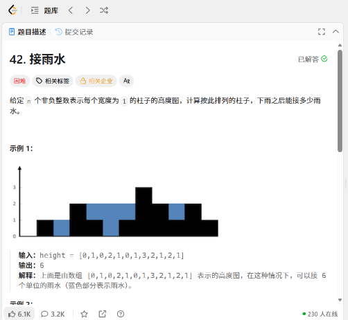
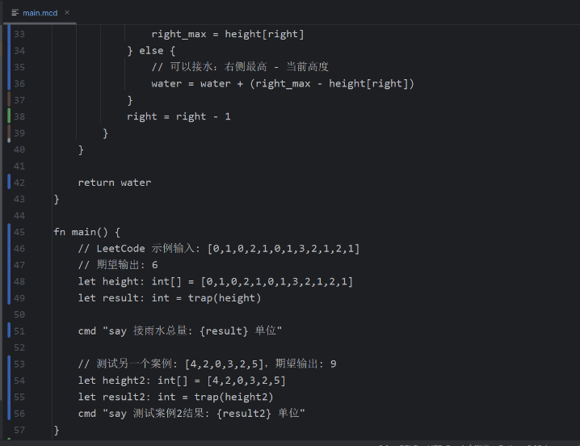
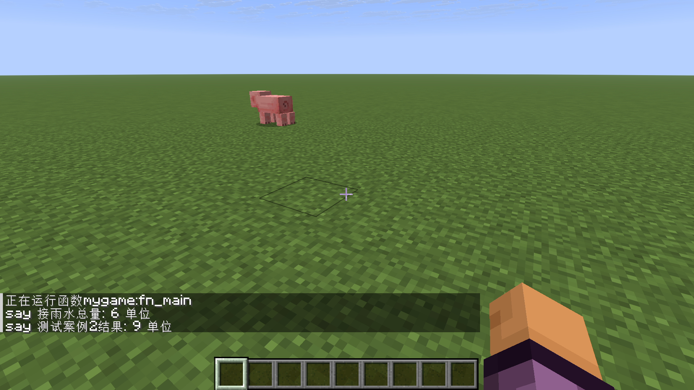

# MCC - Minecraft Compiler

MCC 是一个将类高级语言语法编译为 Minecraft 数据包（Datapack）的编译器。它支持类型系统、函数、结构体、控制流和注解系统，让你可以用现代编程方式开发 Minecraft 数据包。

## 目录

- [特性](#特性)
- [快速开始](#快速开始)
- [基础语法](#基础语法)
- [模块导入](#模块导入)
- [数据类型](#数据类型)
- [控制流](#控制流)
- [函数](#函数)
- [注解系统](#注解系统)
- [参数传递与返回值](#参数传递与返回值)
- [作用域与生命周期](#作用域与生命周期)
- [Minecraft 集成](#minecraft-集成)
- [完整示例](#完整示例)
- [注意事项与限制](#注意事项与限制)
- [调试技巧](#调试技巧)
- [效果示例](#效果示例)

## 特性

- **静态类型系统**：编译期类型检查，支持类型推导和显式标注
- **多样化注解**：通过 `$tick`, `$tag`, `$event`, `$predicate`, `$loot` 等注解自动生成数据包配置
- **结构体支持**：支持嵌套结构体和结构体数组
- **实体集成**：原生支持 Minecraft 实体选择器和 NBT 操作
- **定点数浮点**：使用定点数（×100）实现浮点数运算
- **自动化合并**：同名标签自动合并，无需担心重复定义

## 快速开始

### 编译命令

```bash
./mcc source.mcc ./output/my_datapack
```

### 输出结构

```
output/
├── pack.mcmeta
└── data/
    ├── mynamespace/
    │   ├── functions/  # .mcfunction 文件
    │   ├── predicates/ # 谓词 JSON
    │   └── loot_tables/ # 战利品表
    └── minecraft/
        ├── tags/functions/ # 函数标签（tick, load等）
        └── advancements/ # 进度触发器
```

## 基础语法

### 注释

```mcc
// 单行注释

/*
  多行注释
*/
```

### 变量声明

使用 `let` 关键字，支持类型推导和显式标注：

```mcc
// 基本类型
let health = 100                    // int，自动推导
let damage: float = 15.5            // float，显式标注
let playerName = "Steve"            // string
let isAlive = true                  // bool

// 数组
let items: string[] = ["sword", "shield", "apple"]
let scores = [10, 20, 30, 40]       // int[]

// 结构体（先定义类型）
struct Vec3 {
    x: float,
    y: float,
    z: float
}

let pos: Vec3 = {x: 10.0, y: 64.0, z: -5.0}

// 使用构造函数（可选）
let pos2 = Vec3({x: 0.0, y: 80.0, z: 0.0})
```

### 赋值

```mcc
let count = 0
count = 10                          // 修改值

// 数组元素赋值
items[0] = "diamond_sword"

// 结构体字段赋值
pos.x = 20.0

// 复合赋值（实体数组）
players[0].Health = 20.0
```

## 模块导入
MCC 支持模块化开发，允许将代码拆分到多个文件并通过 import 语句复用函数和结构体定义。
``` 
基本语法
// 1. 全量导入：导入模块中的所有导出内容
import "./utils.mcc"

// 2. 选择性导入：只导入指定的函数或结构体
import { sqrt, abs, Vec2 } from "./math.mcc"
```
注意：
导入路径必须是双引号包裹的字符串
可省略 .mcc 扩展名，编译器会自动补全
不支持绝对路径（如 /home/user/...）
## 数据类型

### 基本类型

| 类型 | 说明 | 示例 | 存储方式 |
|------|------|------|---------|
| `int` | 整数 | `42`, `-10` | scoreboard |
| `float` | 浮点数（定点数） | `3.14`, `-0.5` | scoreboard (×100) |
| `string` | 字符串 | `"hello"` | data storage |
| `bool` | 布尔值 | `true`, `false` | scoreboard (0/1) |

**注意**：`float` 使用定点数实现（数值 ×100 存储），精度为 0.01。

### 数组

```mcc
let nums: int[] = [1, 2, 3, 4, 5]
let empty: int[] = []               // 空数组

// 获取长度
let len = length(nums)              // 内置函数

// 访问元素
let first = nums[0]
let last = nums[4]

// 修改元素
nums[2] = 100
```

### 结构体

```mcc
struct PlayerData {
    name: string,
    level: int,
    pos: Vec3,
    health: float
}

// 创建实例
let player = {
    name: "Alex",
    level: 5,
    pos: {x: 100.0, y: 64.0, z: -200.0},
    health: 20.0
}

// 访问字段
let n = player.name
let x = player.pos.x
```

### 实体类型
entity类型在使用@p等选择器获取后会分配唯一的一个tag标签用于后续追踪，在后续使用的时候作用同一个实体
```mcc
// 实体选择器作为值
let target: entity = @p
let monsters: entity[] = @e[type=zombie,distance=..10]

// 访问实体属性（只读）
let hp = target.Health              // float
let air = target.Air                // int

// 实体NBT控制
let target: entity = @p
target.Health = 0                 // 设置生命值
target.Air = 300                  // 设置氧气值
// 或者通过索引语法
target["Health"] = 0
target["Air"] = 300
```

## 控制流

### if / else

```mcc
let score = 85

if score >= 90 {
    cmd "say 优秀"
} else {
    cmd "say 不及格"
}

// 暂不支持 else if语法
```

### for 循环

**范围循环**（左闭右开）：
```mcc
// i 从 0 到 9
for i in 0..10 {
    cmd "say 当前数字: {i}"
}
```

**数组遍历**：
```mcc
let items = ["a", "b", "c"]
for item in items {
    cmd "say 物品: {item}"
}
```

**实体遍历**：
```mcc
for player in @a {
    cmd "execute as {player} run say 你好"
}

for zombie in @e[type=zombie] {
    cmd "execute as {zombie} run data merge entity @s {Glowing:1b}"
}
```

### while 循环

```mcc
let counter = 10

while counter > 0 {
    cmd "say 倒计时: {counter}"
    counter = counter - 1
}

// 无限循环（自动转为 tick 函数，不推荐使用，推荐使用$tick标签）
while true {
    cmd "say 每 tick 执行"
}
```

## 函数
函数不支持递归
### 定义函数

```mcc
// 无参数，无返回值
fn say_hello() {
    cmd "say 你好，世界！"
}

// 带参数
fn greet(name: string) {
    cmd "tellraw @a {\"text\":\"你好, {name}!\"}"
}

// 带返回值
fn add(a: int, b: int) -> int {
    return a + b
}

// 数组参数
fn sum(arr: int[]) -> int {
    let total = 0
    for num in arr {
        total = total + num
    }
    return total
}
```

**函数名转换**：
- 代码中写的 `say_hello`，实际生成 `fn_say_hello.mcfunction`
- 标签中引用时自动处理为 `{namespace}:fn_say_hello`

### 调用函数

```mcc
say_hello()                         // 直接调用
greet("Steve")                      // 传参

let result = add(10, 20)            // 获取返回值
let total = sum([1, 2, 3, 4])       // 数组传参
```

## 注解系统

注解是 MCC 的核心特性，用于声明式地生成数据包配置。

### $tick - 定时执行

```mcc
// 每 tick 执行一次（直接注册到 tick.json）
$tick(1)
fn game_loop() {
    cmd "function mynamespace:custom_logic"
}

// 每 20 tick（1秒）执行一次（使用计时器）
$tick(20)
fn slow_update() {
    cmd "say 每秒更新"
}
```

**区别说明**：
- `$tick(1)`：直接加入 minecraft 的 tick 标签，每 tick 执行，性能开销最小
- `$tick(N)`：生成 `__tick__` 函数和计时器变量，每 N tick 执行一次

### $tag - 函数标签

**方式一：注解函数**
```mcc
$tag("game:events")
fn on_player_join() {
    cmd "say 欢迎加入"
}

$tag("game:events")
fn on_player_leave() {
    cmd "say 再见"
}
// 自动生成 data/minecraft/tags/function/game/events.json
// 包含: ["mynamespace:fn_on_player_join", "mynamespace:fn_on_player_leave"]
```

**方式二：静态标签声明（合并多个函数）**
```mcc
$tag function("load") {
    init_system,
    setup_scores,
    welcome_message
}

$tag function("load") {
    check_version
}
// 自动合并为同一个 load.json，包含所有 4 个函数
```

**语法规则**：
- entries 使用**裸标识符**（不带引号，不带 `fn_` 前缀，不带命名空间）
- 编译器自动添加 `fn_` 前缀和命名空间
- 多个同名标签自动合并 values

### $event - 事件触发器

基于 Minecraft 进度（Advancement）实现的事件监听：

```mcc
$event("minecraft:player_killed_entity", {})
fn on_kill() {
    cmd "say 击杀成功"
    cmd "give @s minecraft:experience_bottle 3"
}

$event("minecraft:player_damaged_entity", {
    damage: {
        type: "player"
    }
})
fn on_damage() {
    cmd "say 造成伤害"
}
```

**自动注入**：编译器会自动在函数开头添加：
```mcfunction
advancement revoke @s only minecraft:mynamespace/on_kill
```

### $predicate - 谓词定义

生成谓词 JSON 文件，**不生成函数体**：

```mcc
$predicate("entity/is_boss")
fn check_boss() {
    condition {
        entity @s {
            Health: 100.0
        }
    }
}

$predicate("entity/has_item")
fn has_diamond() {
    condition {
        entity @s {
            nbt: {Inventory:[{id:"minecraft:diamond"}]}
        }
    }
}
```

生成 `data/mynamespace/predicates/entity/is_boss.json`。

### $loot - 战利品表

生成战利品表 JSON，**不生成函数体**：

```mcc
$loot("entities/boss_drops")
fn boss_loot() {
    loot """{
        "type": "entity",
        "pools": [
            {
                "rolls": 1,
                "entries": [
                    {
                        "type": "minecraft:item",
                        "name": "minecraft:diamond",
                        "functions": [
                            {
                                "function": "minecraft:set_count",
                                "count": 5
                            }
                        ]
                    }
                ]
            }
        ]
    }"""
}
```

## 参数传递与返回值

### 值传递（int, float, bool）

基本类型作为值传递，函数内修改不影响外部：

```mcc
fn modify(x: int) {
    x = 100
    cmd "say 内部: {x}"      // 输出 100
}

let a = 10
modify(a)
cmd "say 外部: {a}"          // 输出 10（不变）
```

### 引用传递（array, struct, entity）

复合类型作为引用传递，函数内修改会影响外部：

```mcc
fn heal_player(p: PlayerData) {
    p.health = 20.0          // 修改原结构体
}

let player = {name: "Steve", health: 10.0, ...}
heal_player(player)
// player.health 现在是 20.0
```

### 字符串处理

字符串存储在 data storage 中，作为引用传递，但赋值会复制：

```mcc
fn set_name(name: string) {
    // name 是 storage 路径的引用
    cmd "say {name}"
}

let n = "Alice"
set_name(n)                  // 传递 storage 路径
```

## 作用域与生命周期

### 块级作用域
注：代码中的块级作用域要在if或者while等循环中的块，如果直接花括号会导致语法错误
```mcc
fn scope_demo() {
    let x = 10               // 函数级作用域
    
    {
        let y = 20           // 块级作用域
        cmd "say {x}, {y}"   // 都可以访问
    }
    
    cmd "say {x}"            // OK
    // cmd "say {y}"         // 错误：y 已销毁
}
```

### 变量遮蔽

允许内层遮蔽外层同名变量：

```mcc
let x = 10
{
    let x = 20               // 遮蔽外层 x
    cmd "say {x}"            // 20
}
cmd "say {x}"                // 10（外层）
```

## Minecraft 集成

### cmd 语句

执行原始 Minecraft 命令，支持变量插值：

```mcc
let player = "Steve"
let count = 5

cmd "say 玩家 {player} 有 {count} 个物品"
cmd "give @s minecraft:diamond {count}"
cmd "execute as @a at @s run particle minecraft:flame ~ ~1 ~ 0 0 0 0 10"
```

**重要限制**：`cmd` 中只支持简单变量插值 `{varname}`，**不支持** `{obj.field}`。需要先提取：

```mcc
// ❌ 错误：cmd "tp @s ~{pos.x} ~{pos.y} ~{pos.z}"

// ✅ 正确：
let x = pos.x
let y = pos.y
let z = pos.z
cmd "tp @s ~{x} ~{y} ~{z}"
```

### 内置函数

| 函数 | 说明 | 示例 |
|------|------|------|
| `len(arr)` | 数组长度 | `let n = len(items)` |

## 完整示例

### 示例1：玩家管理系统

```mcc
struct PlayerInfo {
    name: string,
    kills: int,
    deaths: int
}

$tick(20)
fn update_leaderboard() {
    for player in @a {
        cmd "execute as {player} run function mynamespace:check_stats"
    }
}

$event("minecraft:player_killed_entity", {})
fn on_player_kill() {
    cmd "scoreboard players add @s kills 1"
    cmd "tellraw @s {\"text\":\"击杀 +1\",\"color\":\"green\"}"
}

fn reset_stats(p: entity) {
    cmd "scoreboard players set {p} kills 0"
    cmd "scoreboard players set {p} deaths 0"
}
```

### 示例2：Boss 战系统

```mcc
$predicate("entity/is_boss")
fn is_boss() {
    condition {
        entity @s {
            Health: 200.0
        }
    }
}

$loot("entities/boss_drops")
fn boss_drops() {
    loot """{
        "type": "entity",
        "pools": [{
            "rolls": 1,
            "entries": [{
                "type": "minecraft:item",
                "name": "minecraft:diamond_sword",
                "functions": [{
                    "function": "minecraft:set_name",
                    "name": {"text": "神器", "italic": false}
                }]
            }]
        }]
    }"""
}

$tick(1)
fn boss_checker() {
    cmd "execute as @e[type=zombie,tag=boss] run function mynamespace:boss_ai"
}
```

### 示例3：带过载的定时任务

```mcc
// 高速更新（每 tick）
$tick(1)
fn fast_update() {
    cmd "function mynamespace:particle_effects"
}

// 中速更新（每半秒）
$tick(10)
fn medium_update() {
    cmd "function mynamespace:check_triggers"
}

// 低速更新（每 5 秒）
$tick(100)
fn slow_update() {
    cmd "say 自动保存中..."
    cmd "save-all"
}

// 初始化（加载时执行一次）
$tag function("load") {
    init_system,
    setup_config
}

fn init_system() {
    cmd "say 系统初始化完成"
    cmd "scoreboard objectives add health dummy"
}
```

## 注意事项与限制

1.  **Float 精度**：使用定点数（×100），最大精度 0.01，范围约 -21474836.48 到 21474836.47
2.  **数组长度**：数组最大长度建议不超过 50，超大会影响性能
3.  **结构体字段访问**：在 `cmd` 语句中不支持直接 `{obj.field}`，需要先提取到临时变量
4.  **函数命名**：
    - 代码中写 `my_func`，生成文件为 `fn_my_func.mcfunction`
    - 标签中自动处理，无需手动加前缀
5.  **实体存储**：实体变量存储的是选择器字符串（如 `@e[tag=...]`），在函数间传递时需注意选择器有效性
6.  **$event 自动注入**：被 `$event` 标记的函数会自动在开头添加 `advancement revoke`，无需手动编写
7.  **$predicate 和 $loot**：这两个注解**不生成函数体**（.mcfunction 文件），只生成对应的 JSON 配置

## 调试技巧

使用 `cmd "say ..."` 输出调试信息：

```mcc
fn debug_example() {
    let x = calculate()
    cmd "say 计算结果: {x}"
    
    if x > 100 {
        cmd "say 数值过大"
    }
}
```

查看生成的 `.mcfunction` 文件，了解编译器如何将高级语法转换为 Minecraft 命令。

## 效果示例

以leetcode的接雨水这道题示例


mcc 代码截图


运行结果

